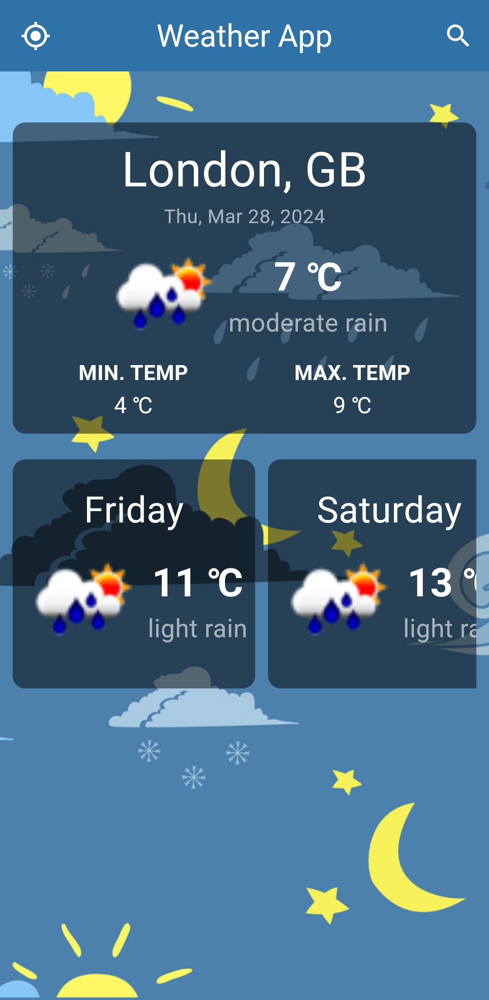
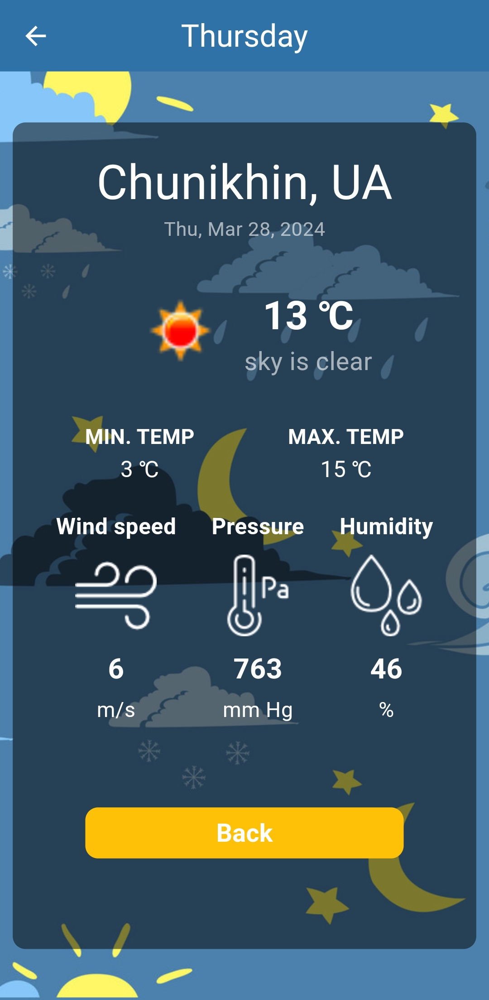
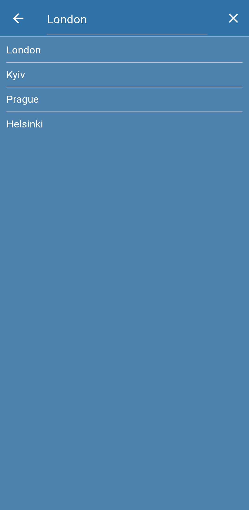

<h1 align="center">Flutter Weather App</h1>

<p align="center">
  
  
  
</p>

## Overview

A simple Weather App created using API from [OpenWeatherMap](https://openweathermap.org/).

### Key Features

* Weather forecast for 7 days
* Weather forecast by city name
* Weather forecast by geolocation
* Detailed weather forecast info

### How to Run

1. Clone the repo
   ```sh
   git clone https://github.com/Silgorn/weather_app.git
   ```
2. Install all the packages by typing the following command
   ```sh
   flutter pub get
   ```
3. Run the App